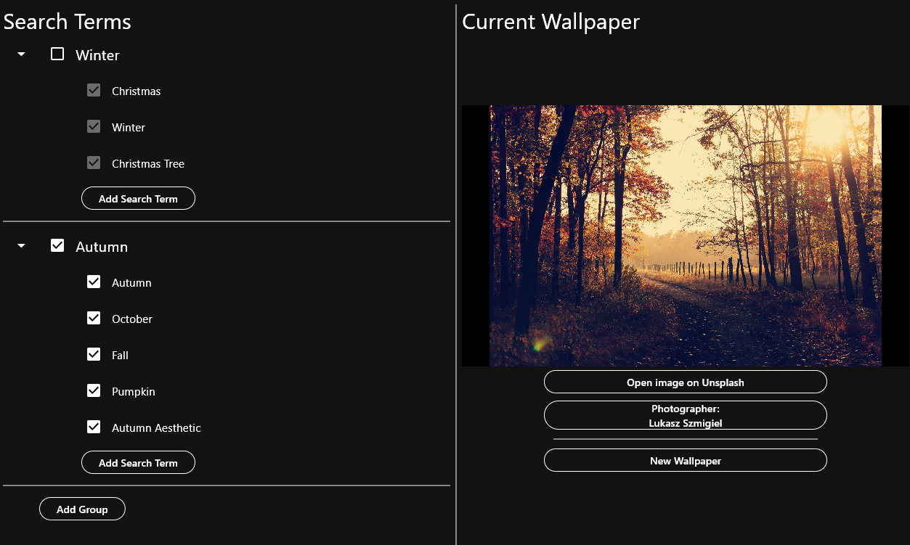
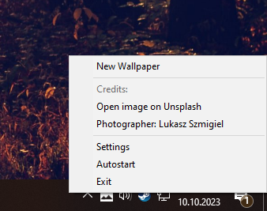

# WonderWall


A simple application for generating windows wallpapers, with following features:
- 🌄 Downloads beautiful high resolution images from [Unsplash.com](https://unsplash.com/)
- ⏬ Images are downloaded based off customizable search terms
- ✅ Search terms can be disabled and grouped for maximum flexibility
- 💨 Windows system tray integration to quickly change the wallpaper and open the settings
- 📅 Windows autostart support to change your wallpaper daily

<p align="center">
    <br>
    Settings
</p>

<p align="center">
    <br>
    System tray
</p>


## Installation
To install your own version of Wonderwall follow these steps:
1. Download the newst version from [Releases](https://github.com/Mano176/WonderWall/releases)
2. Head to [Unsplash](https://unsplash.com/developers) and create your own Unsplash-App. Then copy your client id
3. Open the file `wonderwall/data/flutter_assets/assets/secrets.json`. The file looks like this:
    ```json
    {"clientId": "[your client id]"}
    ```
4. Replace `[your client id]` with your Unsplash client id and save the file
5. Run `wonderwall.exe`